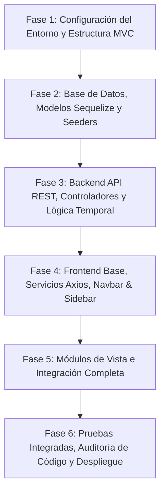

# Plan de Trabajo: Sistema de Gestión Integral de Spa 💆‍♀️🌿

> **Bases del Proyecto**: Este plan de trabajo se rige de forma estricta y obligatoria por lo establecido en [constitution.md](file:///F:/Modulo%208/Proyecto%20Final/constitution.md) y [spec.md](file:///F:/Modulo%208/Proyecto%20Final/spec.md), implementando una arquitectura **MVC Desacoplada** (Backend API REST y Frontend independiente) con **100% de código comentado**.

---

## 🎯 Objetivo General
Desarrollar, estructurar, integrar y verificar el Sistema de Gestión Integral de Spa cumpliendo con la gestión de las **4 salas temáticas (Agua, Aire, Tierra, Fuego)**, los **12 bloques de horario (8:00 AM a 8:00 PM)**, las reglas de **confirmación de salas (1 hora antes / 20 minutos express)**, la **liberación exclusiva por el Administrador** y la administración integral de clientes, citas e inventario.

---

## 🗓️ Fases de Ejecución

---

### 📦 FASE 1: Configuración del Entorno y Estructura Base MVC
- [x] **1.1. Estructura de Directorios Desacoplada**:
  - Crear directorio `backend/` para la API REST.
  - Crear directorio `frontend/` para las vistas y assets de cliente.
- [x] **1.2. Inicialización del Backend**:
  - Configurar `backend/package.json` con dependencias: `express`, `sequelize`, `sqlite3` (o `pg`/`mysql2`), `cors`, `dotenv`, `bcryptjs`, `jsonwebtoken`.
  - Configurar `backend/server.js` con middlewares globales (CORS, JSON parser, rutas base).
  - Configurar `backend/config/database.js` y variables de entorno `.env`.
- [x] **1.3. Inicialización del Frontend**:
  - Configurar carpetas de assets (`frontend/public/assets/css`, `frontend/public/assets/js`, `frontend/public/assets/img`).
  - Configurar cliente base de Axios con interceptor de token JWT en `frontend/public/assets/js/api/axiosClient.js`.

---

### 🗄️ FASE 2: Capa de Datos, Modelos Sequelize y Seeders
- [x] **2.1. Definición de Modelos (100% Comentados)**:
  - `Usuario.js`: Campos `nombre`, `email`, `password_hash`, `rol` (`admin` / `masoterapeuta`), `activo`.
  - `Sala.js`: Nombres temáticos `Agua`, `Aire`, `Tierra`, `Fuego`, capacidad, descripción, activa.
  - `Cliente.js`: `nombre`, `dni`, `telefono`, `email`, `notas_clinicas`.
  - `Cita.js`: Relaciones con `Cliente`, `Usuario` y `Sala`, `fecha`, `hora_inicio`, `hora_fin`, `deadline_confirmacion`, `estado` (`pendiente_confirmacion`, `confirmada`, `ocupada`, `completada`, `cancelada`, `liberada_automatica`).
  - `Producto.js`: Control de stock, reserva, stock mínimo y precio.
  - `Proveedor.js`, `CompraInsumo.js` y `ConsumoInsumo.js`.
- [x] **2.2. Relaciones y Asociaciones Sequelize**:
  - Configurar asociaciones en `backend/models/index.js`.
- [x] **2.3. Migraciones y Seeders Iniciales**:
  - Seeder de las 4 Salas: `Agua`, `Aire`, `Tierra`, `Fuego`.
  - Seeder de Usuarios Iniciales: Administrador y Masajistas de prueba.
  - Seeder de Insumos base (aceites relajantes, cremas termogénicas, toallas, esencias).

---

### ⚙️ FASE 3: Backend API REST, Controladores y Lógica Temporal
- [x] **3.1. Middlewares de Seguridad y Roles**:
  - `auth.middleware.js`: Verificación de Token JWT.
  - `role.middleware.js`: Guardián de permisos para Administrador y Masoterapeutas.
- [x] **3.2. Controlador de Autenticación (`auth.controller.js`)**:
  - Login con hash de contraseñas (`bcryptjs`), generación de token, perfil y **alta de nuevos masajistas exclusiva para Administrador** (`POST /api/v1/auth/masajistas`).
- [x] **3.3. Controlador de Citas y Matriz de Salas (`citas.controller.js`)**:
  - `getDisponibilidad`: Matriz de 12 bloques x 4 salas con cálculo de estados y **protección de nombres de clientes individuales para masajistas**.
  - `createReserva`: Creación de cita vinculada a clientes individuales y autoasignación de masajista.
  - `confirmarSala`: Confirmación de sala por el masajista dueño o Administrador dentro del plazo (1h / 20min).
  - `reprogramarCita`: Cambio de fecha/horario/sala (**Exclusivo Administrador si la cita está confirmada**; masajista dueño si está pendiente).
  - `cancelarCita` / `liberarCitaConfirmada`: Cancelación de cita (**Exclusivo Administrador si la cita está confirmada**; masajista dueño si está pendiente).
  - `completarCita`: Cierre de sesión y deducción automática de insumos.
- [x] **3.4. Controlador de Inventario (`inventario.controller.js`)**:
  - CRUD de productos, compras a proveedores y métricas de consumo (Exclusivo Admin).
- [x] **3.5. Controlador de Clientes y Dashboard (`clientes.controller.js` y `dashboard.controller.js`)**:
  - Fichas individuales por terapeuta con registro de `creado_por` y visualización global para el Administrador.

---

### 🎨 FASE 4: Frontend Base, Componentes Comunes (Navbar & Sidebar)
- [x] **4.1. Diseño y Maquetación Base (CSS3)**:
  - Hojas de estilo modular (`global.css`, `navbar-sidebar.css`, `portal.css`, `dashboard.css`).
  - Paleta de colores temáticos para las salas (Agua 💧, Aire 💨, Tierra 🌿, Fuego 🔥) y semáforo de disponibilidad (🟢, 🟡, 🔵, 🔴).
- [x] **4.2. Componente Navbar Superior**:
  - Logo del Spa, selector dinámico de calendario, filtro de horarios mañana/tarde, saludo `"Bienvenido, [Nombre]"`, badge de rol y botón **Logout**.
- [x] **4.3. Componente Sidebar Lateral Adaptativo**:
  - Menú con: Dashboard, Historial de Citas, Reservas (Salas), Inventario (*solo Admin*) y Ficha Cliente.
- [x] **4.4. Servicios de Comunicación Axios**:
  - `authService.js`, `citasService.js`, `inventarioService.js`, `clientesService.js`, `dashboardService.js`.

---

### 🖥️ FASE 5: Implementación de Módulos de Vista e Integración
- [x] **5.1. Portal Público (`frontend/views/index.html`)**:
  - Home, catálogo de servicios en salas temáticas, sección institucional, galería y formulario de solicitud de cita.
- [x] **5.2. Vista de Login (`frontend/views/login.html`)**:
  - Formulario de autenticación con redirección según rol y botones rápidos de prueba.
- [x] **5.3. Vista de Reservas - Matriz de 4 Salas y 12 Horarios (`frontend/views/reservas.html`)**:
  - Renderizado dinámico de la cuadrícula de 4 salas x 12 bloques (8:00 AM - 8:00 PM).
  - Modal de agendamiento rápido con selector de cliente individual y botón `➕ Nuevo Cliente`.
  - Botón de confirmación para masajistas (`✓ Confirmar Sala`).
  - Botones y modal de cambio de horario (`⏰ Cambiar Horario`) y cancelación (`🗑️ Cancelar/Liberar`) exclusivos del Administrador para citas confirmadas.
  - Botón y modal de registro de nuevos masajistas exclusivo para el Administrador (`💆 Nuevo Masajista (Admin)`).
  - Anonimización visual de nombres de clientes de otros terapeutas (`👤 [Cliente Reservado]`).
- [x] **5.4. Vista de Historial de Citas (`frontend/views/historial.html`)**:
  - Tabla con filtros por fecha, sala y estado (*Pendiente*, *Confirmada*, *Completada*, *Cancelada*).
- [x] **5.5. Vista de Inventario (`frontend/views/inventario.html`)**:
  - Tabla de stock, registro modal de compras a proveedores y visualizador de consumo con Chart.js.
- [x] **5.6. Vista de Ficha de Clientes (`frontend/views/ficha-cliente.html`)**:
  - Expedientes individuales para masajistas y expedientes globales para el Administrador.
- [x] **5.7. Vista de Dashboard (`frontend/views/dashboard.html`)**:
  - Tarjetas de KPIs y gráficos con Chart.js (citas/mes, ingresos, consumo y ocupación de salas).

---

### 🧪 FASE 6: Pruebas Integradas, Auditoría de Código y Verificación
- [x] **6.1. Validación de Reglas de Negocio Temporales y Permisos**:
  - Verificación de confirmación de salas por masajistas individuales.
  - Verificación de bloqueo 403 para masajistas en modificación/cancelación de citas confirmadas.
  - Verificación de permisos exclusivos del Administrador para reprogramar y cancelar citas confirmadas.
  - Verificación de privacidad de nombres de clientes (anonimización para terceros).
  - Verificación de bloqueo 403 para creación de masajistas por usuarios no administradores y alta exitosa por Admin.
- [x] **6.2. Auditoría de Código 100% Comentado**:
  - Todos los archivos contienen documentación JSDoc y comentarios explicativos.
- [x] **6.3. Verificación de Manuales y Documentación**:
  - Coherencia total entre la implementación y `constitution.md`, `spec.md`, `readme.md` y `manual.md`.
