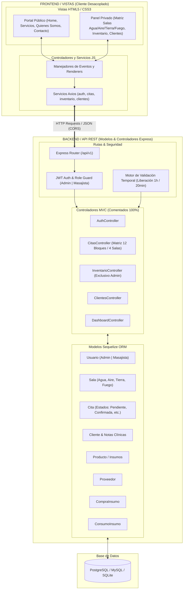
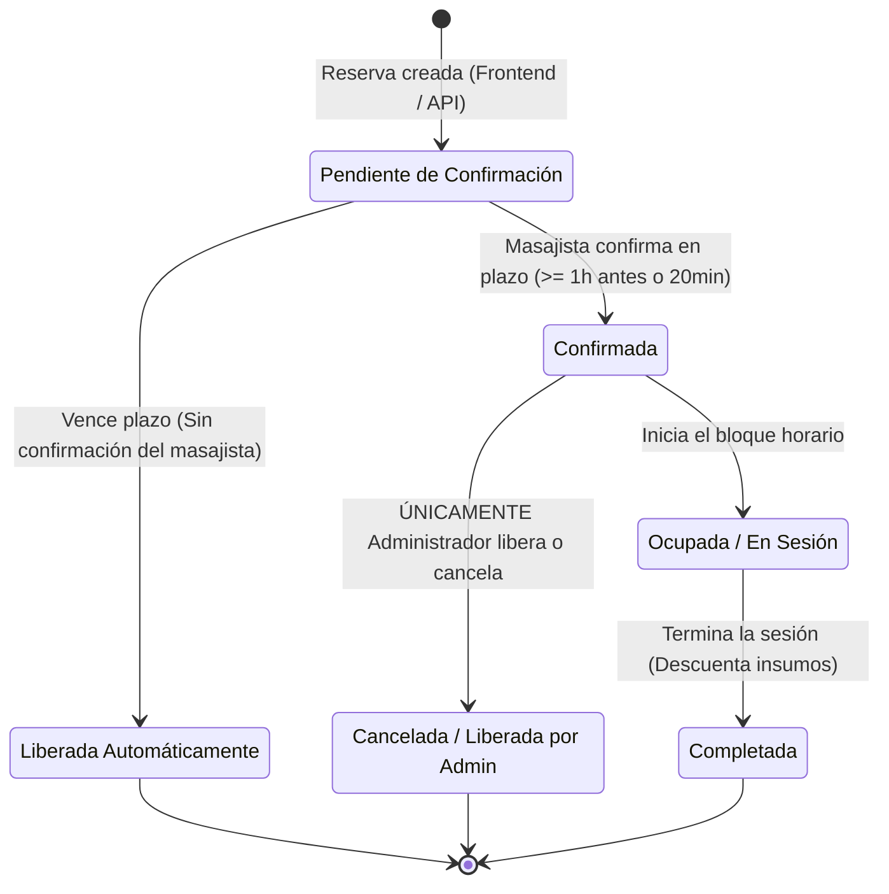
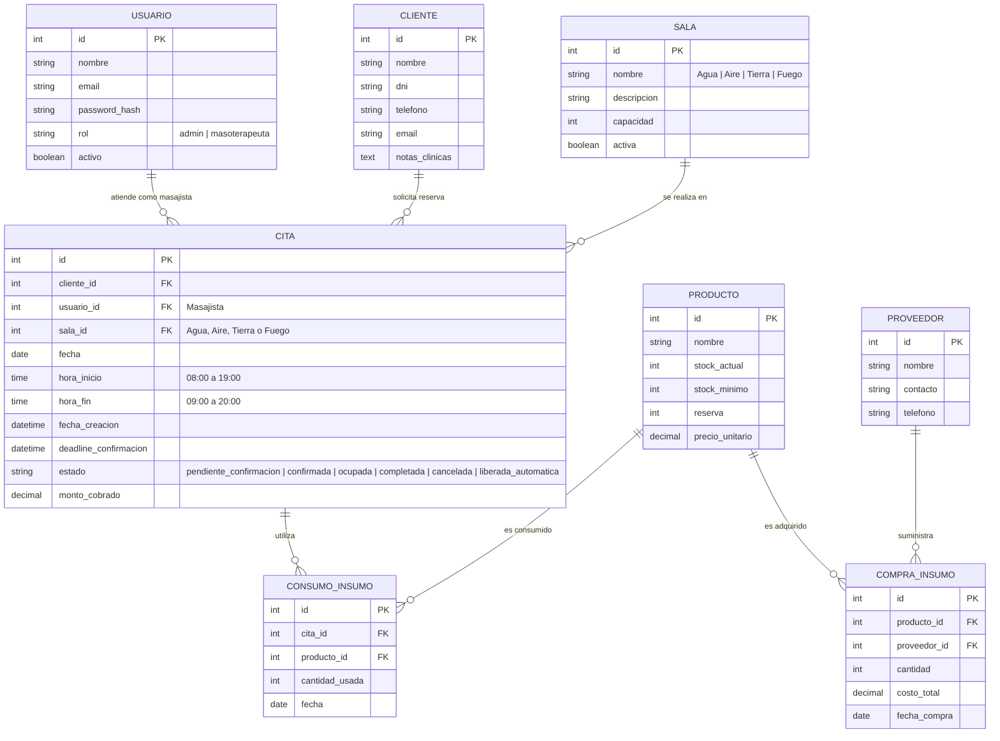

# Especificación Técnica y Funcional (Spec): Sistema de Gestión de Spa

## 1. Arquitectura del Sistema: Patrón MVC Desacoplado

El sistema implementa una arquitectura basada en el patrón **Modelo - Vista - Controlador (MVC)** dividida físicamente en dos componentes independientes:
- **Backend (API REST)**: Desarrollado en Node.js con Express y Sequelize ORM para el manejo de modelos, reglas de negocio y endpoints.
- **Frontend (Vistas y Controladores de UI)**: Desarrollado con HTML5 semántico, CSS3 y JavaScript modular, comunicándose mediante Axios con la API.
- **Directriz de Desarrollo**: **Todo el código fuente (Backend y Frontend) debe estar 100% comentado y documentado** para garantizar mantenibilidad y claridad operativa.



---

## 2. Nombres de Salas y Matriz de 12 Bloques Horarios

### 2.1. Salas Temáticas
El centro de masoterapia cuenta con **4 salas fijas**:
1. 💧 **Sala Agua**: Especializado en masajes relajantes fluidos.
2. 💨 **Sala Aire**: Especializado en masajes tantricos y relajantes. 
3. 🌿 **Sala Tierra**: Especializada en piedras calientes y masajes profundos.
4. 🔥 **Sala Fuego**: Especializada en bambuterapia y masajes descontracturantes intensos.

### 2.2. Matriz de 12 Bloques Horarios (8:00 AM a 8:00 PM)
El rango operativo cubre exactamente 12 horas divididas en bloques de 1 hora:

| Bloque | Rango Horario | Sala Agua | Sala Aire | Sala Tierra | Sala Fuego |
| :---: | :---: | :---: | :---: | :---: | :---: |
| **1** | `08:00 - 09:00` | 🟢 Disponible | 🟢 Disponible | 🟢 Disponible | 🟢 Disponible |
| **2** | `09:00 - 10:00` | 🟢 Disponible | 🟡 Reservado | 🟢 Disponible | 🔵 Confirmado |
| **3** | `10:00 - 11:00` | 🟢 Disponible | 🟢 Disponible | 🔵 Confirmado | 🟢 Disponible |
| **4** | `11:00 - 12:00` | 🟡 Reservado | 🟢 Disponible | 🟢 Disponible | 🔴 Ocupado |
| **5** | `12:00 - 13:00` | 🟢 Disponible | 🟢 Disponible | 🟢 Disponible | 🟢 Disponible |
| **6** | `13:00 - 14:00` | 🟢 Disponible | 🔵 Confirmado | 🟢 Disponible | 🟢 Disponible |
| **7** | `14:00 - 15:00` | 🟢 Disponible | 🟢 Disponible | 🟢 Disponible | 🟢 Disponible |
| **8** | `15:00 - 16:00` | 🔵 Confirmado | 🟢 Disponible | 🟡 Reservado | 🟢 Disponible |
| **9** | `16:00 - 17:00` | 🟢 Disponible | 🟢 Disponible | 🟢 Disponible | 🔴 Ocupado |
| **10** | `17:00 - 18:00` | 🟢 Disponible | 🟡 Reservado | 🟢 Disponible | 🟢 Disponible |
| **11** | `18:00 - 19:00` | 🟢 Disponible | 🟢 Disponible | 🔵 Confirmado | 🟢 Disponible |
| **12** | `19:00 - 20:00` | 🟢 Disponible | 🟢 Disponible | 🟢 Disponible | 🟢 Disponible |

---

## 3. Lógica de Negocio y Ciclo de Vida de las Citas

### 3.1. Máquina de Estados de una Cita


### 3.2. Reglas de Confirmación y Liberación Automática
1. **Reserva Estándar (Creada con > 1 hora de anticipación)**:
   - `deadline_confirmacion = fecha_hora_inicio - 1 hora`.
   - El masajista debe ingresar a su panel y pulsar **"Confirmar Sala"**.
   - Si `hora_actual >= deadline_confirmacion` y el estado sigue en `pendiente_confirmacion`, el sistema cambia el estado a `liberada_automatica` y libera la sala a 🟢 **Disponible**.
2. **Reserva Urgente / Express (Creada con <= 1 hora de anticipación)**:
   - `deadline_confirmacion = fecha_hora_creacion + 20 minutos`.
   - Si transcurren más de 20 minutos desde la creación sin confirmación, el sistema ejecuta la liberación automática inmediata.
3. **Restricción Estricta de Liberación sobre Citas Confirmadas**:
   - Cuando una cita tiene estado `confirmada` (🔵), los masajistas tienen **restringido** el botón o endpoint de cancelación.
   - **Solo el usuario con rol `admin`** tiene permisos para ejecutar `PATCH /api/v1/citas/:id/liberar` sobre una cita confirmada.

---

## 4. Modelo de Datos Relacional (Sequelize)



---

## 5. Endpoints de la API REST (Backend Express)

| Método | Endpoint | Middleware / Rol | Descripción y Reglas de Negocio |
| :--- | :--- | :--- | :--- |
| `POST` | `/api/v1/auth/login` | Público | Autentica usuario y retorna JWT + Rol (`admin` o `masoterapeuta`). |
| `GET` | `/api/v1/salas` | Autenticado | Retorna las 4 salas activas (`Agua`, `Aire`, `Tierra`, `Fuego`). |
| `GET` | `/api/v1/citas/disponibilidad` | Autenticado | Devuelve la matriz de 12 bloques para las 4 salas en la fecha indicada. Ejecuta validación de liberación automática al vuelo. |
| `POST` | `/api/v1/citas` | Masajista / Admin | Crea reserva. Calcula automáticamente el `deadline_confirmacion` (1h antes o +20min si es express). |
| `PATCH` | `/api/v1/citas/:id/confirmar` | Masajista / Admin | El masajista confirma la sala asignada dentro del plazo. Cambia estado a `confirmada`. |
| `PATCH` | `/api/v1/citas/:id/liberar` | **Solo Admin** | **Exclusivo Administrador**: Libera o cancela una cita que ya estaba en estado `confirmada`. |
| `PATCH` | `/api/v1/citas/:id/completar` | Masajista / Admin | Marca la cita como completada y descuenta los insumos consumidos. |
| `GET` | `/api/v1/citas/historial` | Autenticado | Listado de citas con filtros de sala, terapeuta y estado. |
| `GET` | `/api/v1/inventario/productos` | Solo Admin | Lista stock de aceites, cremas, toallas y esencias. |
| `POST` | `/api/v1/inventario/compras` | Solo Admin | Registra compra de lote de insumos a proveedores. |
| `GET` | `/api/v1/dashboard/stats` | Autenticado | KPIs de ocupación por salas, citas e ingresos. |

---

## 6. Especificación de Interfaz de Usuario: Navbar y Sidebar (Sistema Interno)

Basado en los diagramas de procesos y wireframes del sistema, la interfaz privada interna para **Masajistas** y **Administradores** cuenta con una estructura común de **Navbar superior** y **Sidebar lateral** adaptativa según los permisos del rol autenticado.

```
+---------------------------------------------------------------------------------------------------------+
| [🌿 SPA Logo]                                   [📅 Calendario] [⏰ Horarios] | Bienvenido, [Nombre] [Logout] |
+------------------+--------------------------------------------------------------------------------------+
| 📊 Dashboard     |                                                                                      |
| 📋 Historial     |                              ÁREA DE CONTENIDO PRINCIPAL                             |
| 📅 Reservas      |         (Dashboard / Matriz de Salas / Historial / Inventario / Ficha Cliente)       |
| 📦 Inventario*   |                                                                                      |
| 👤 Ficha Cliente |                                                                                      |
+------------------+--------------------------------------------------------------------------------------+
  * Inventario visible exclusivamente para rol Administrador.
```

### 6.1. Componente Navbar Superior (Header)
- **Extremo Izquierdo**:
  - `Logo del Spa`: Ícono y nombre del centro de bienestar.
  - Indicador de estado / entorno.
- **Centro / Herramientas Rápidas**:
  - `Selector de Calendario`: Selector de fecha para consultar la disponibilidad de las salas.
  - `Selector de Horarios`: Filtro rápido por franja de mañana/tarde.
- **Extremo Derecho**:
  - `Identificación de Usuario`: Mensaje dinámico `"Bienvenido, [Nombre del Usuario]"`.
  - `Badge de Rol`: Etiqueta distintiva `[Administrador]` o `[Masajista]`.
  - `Botón Logout`: Cierre seguro de sesión e invalidación del token JWT.

### 6.2. Componente Sidebar Lateral (Menú de Navegación)

| Elemento | Ícono | Descripción | Masajista | Administrador |
| :--- | :---: | :--- | :---: | :---: |
| **Dashboard** | 📊 | Visualización de estadísticas y métricas (personales para masajistas; globales, ingresos e insumos para admin). | ✅ (Propias) | ✅ (Globales) |
| **Historial de Citas** | 📋 | Tabla de citas con estados (*Pendiente*, *Confirmada*, *Completada*, *Cancelada*). | ✅ (Propias) | ✅ (Todas) |
| **Reservas (Sala)** | 📅 | Matriz interactiva de las 4 salas (**Agua, Aire, Tierra, Fuego**) y 12 horarios (8:00 AM - 8:00 PM). Permite agendar, confirmar sala y (solo admin) liberar confirmadas. | ✅ | ✅ |
| **Inventario** | 📦 | Módulo 2: Control de existencias de insumos, compras a proveedores y consumo de productos. | ❌ (Oculto) | ✅ (Acceso Total) |
| **Ficha Cliente** | 👤 | Expedientes con DNI, teléfono, notas terapéuticas/clínicas e historial de sesiones. | ✅ (Consulta) | ✅ (Edición Total) |

---

## 7. Estándares Obligatorios de Código Comentado

Cada componente del proyecto debe cumplir las siguientes pautas de comentarios:
1. **Controladores y Rutas**:
   - Cabecera con descripción del endpoint, método HTTP y rol requerido.
   - Comentarios explicativos sobre cada bloque condicional (ej. cálculo de los 20 min o 1h previa, verificación de permisos admin para liberar citas confirmadas).
2. **Modelos Sequelize**:
   - Comentarios en cada atributo explicando su significado, restricciones y valores permitidos.
3. **Servicios y Vistas Frontend**:
   - Comentarios en componentes de Navbar, Sidebar, renderizado del DOM, interceptores de Axios y manejadores de eventos.

